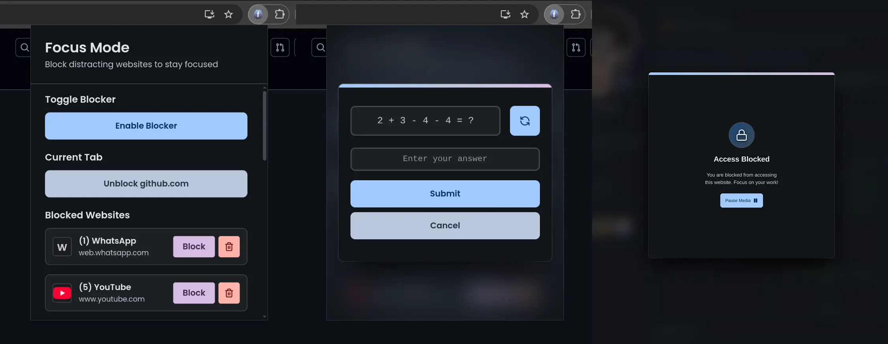

# FOCUS MODE EXTENSION

A chrome extension that helps you focus on your work by blocking distracting websites.

## Features

- Block distracting websites
- Customizable blocking list
- Easy to use
- Lightweight
- Fast
- Secure

## Installation

### Via github releases

- Download the latest release from the [releases page](https://github.com/devlulcas/focus-mode-extension/releases) and extract the zip file.
- Open Chrome and navigate to `chrome://extensions/`.
- Enable Developer Mode.
- Click on `Load unpacked` and select the extracted folder.

### Via local development

- Install node.js and pnpm.
- Clone the repository.
- Run `pnpm install` to install the dependencies.
- Run `pnpm build` to build the extension.
- Open Chrome and navigate to `chrome://extensions/`.
- Enable Developer Mode.
- Click on `Load unpacked` and select the `dist` folder.

## Usage

- Click on the extension icon to open the popup.
- Block the current active tab by clicking on the block button.
- Activate the focus mode by clicking on the focus mode button.

## What is inside?

Just a simple React application. We use `valibot` for validation, `lucide-react` for icons, `clsx` for conditional classes, `expr-eval` for evaluating expressions, `react` and `react-dom` for the UI, `esbuild` for building the extension, `tsx` for the script runner since I had some issues with `node --experimental-transform-types`, `typescript` for the type checker and `@types/chrome` for the chrome API.

For styles I am using CSS Modules.

## How it works?

We save the domains of the websites that we want to block in the chrome storage. Then show a `<dialog>` in front of the current active tab.
You can pause media playing and this is just a simple `document.querySelectorAll` and then `.pause()` on each of them.

## How to contribute?

- Make a PR.

You can fix bugs, add features, improve the code, etc.

## License

MIT

> Do what you want with it.
